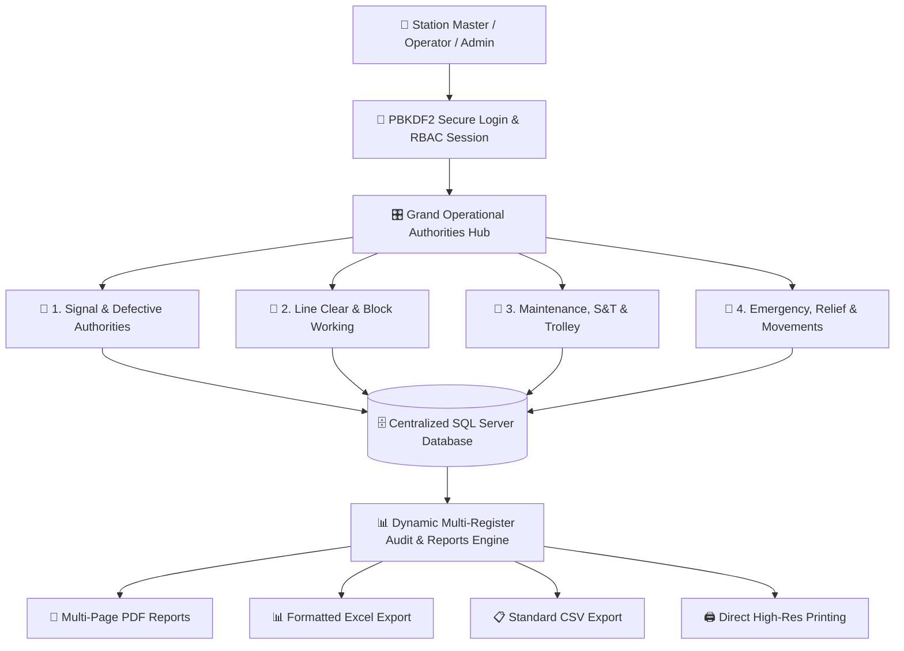
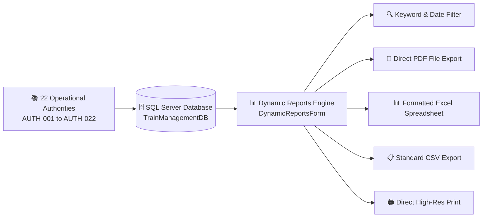

<div align="center">

# 🚆 INDIAN RAILWAYS — TRAIN WORKING MANAGEMENT SYSTEM (TMS)

### 🇮🇳 *Smart Digital Solution for Operational Authorities, Block Working & Centralized Train Movements*

<br/>

<!-- Animated Typing Banner -->
<a href="#">
  
</a>

<br/>

<!-- Technology Badges -->
<p align="center">

  

  

  

  

  

</p>

<br/>

---

</div>

# 🎯 Aim & Main Objective of the Project

The main objective of the **Train Working Management System (TMS)** is to safely monitor, issue, control, and audit railway station operating authorities, line clear grants, block working protocols, and train movement records by replacing manual paper foil books and station registers with a centralized, tamper-proof digital system.

The system encapsulates, validates, and stores:

- 🚦 **Operational Signal Authorities**: Passing defective signals at ON, advance authorizations, and common starter dispatches.
- 🎫 **Block & Line Clear Working**: Telecommunication inquiries, grants, paper line clear tickets, and single line working on double lines.
- 🔧 **Maintenance, S&T & Trolleys**: Disconnections/reconnections (S&T T/351), motor trolley permits (T/1518), and shunting orders (T/806).
- 🚨 **Emergency, Relief & Communication Failure**: Relief train movements (T/A 602), total communication loss logs (T/C 602), and train movement registers.
- 🔍 **Dynamic Audits & Inspections**: Unified cross-register query engine with instant PDF, Excel, and CSV reporting.

> **The goal is simple: Replace vulnerable physical paper authorities and manual registers with a centralized, searchable, secure, and fully auditable digital railway operating system.**

---

# 🌟 Why Train Working Management System (TMS)?

Traditional station train working operations depend on dozens of physical foil books, paper authority pads, and hand-written registers maintained by Station Masters, Section Controllers, Pointsmen, and Signal Maintainers.

The **Train Working Management System (TMS)** transforms these critical safety workflows into an intelligent digital platform.

<table>
<tr>

<td width="48%" valign="top">

## 🛑 Traditional Paper Foil System

❌ **22 separate physical foil books & registers**

❌ High risk of missing, torn, or illegible foil counterfoils

❌ Manual calculation of speed restrictions and safety rules

❌ Time-consuming audit inspections & incident investigations

❌ Difficult to cross-verify Private Numbers across stations

❌ Physical storage overhead with no instantaneous backup

❌ Manual compilation of safety reports and handover diaries

</td>

<td width="4%" align="center">

# ➜

</td>

<td width="48%" valign="top">

## ⚡ Centralized Digital TMS

✅ **One centralized digital operating system**

✅ Permanent, tamper-evident records stored in SQL Server

✅ Real-time validation against Indian Railways operating rules

✅ Instantaneous safety audit inspections & query retrieval

✅ Exact Private Number tracking and cross-register auditing

✅ Automatic multi-instance database restoration and backup

✅ Instant PDF, Excel, and CSV dynamic report generation

</td>

</tr>
</table>

---

> ## 🚀 Result
>
> **Instead of managing dozens of fragile paper authority foils, station staff can issue, record, verify, and report operational train movements through one unified, secure Train Working Management System.**

---

# 🏛️ System Architecture Workflow



---

# 📋 The 22 Operational Authorities & Registers

The Train Working Management System digitizes **22 vital railway operating authorities, permits, notices, and registers**, categorized into four primary operational departments plus a centralized reporting engine.

| Category | Modules | Main Purpose |
|---|:---:|---|
| 🚦 Signal & Defective Authorities | 6 | Defective signals, ON aspect passing, caution orders, common starters |
| 🎫 Line Clear & Block Working | 8 | Line clear inquiry, paper tickets, temporary single line, ABS working |
| 🔧 Maintenance, S&T & Trolley | 4 | Shunting orders, motor/push trolley permits, S&T disconnection notices |
| 🚨 Emergency, Relief & Movements | 4 | Relief trains, total communication failure, ABS relief engines, movement logs |
| **TOTAL** | **22** | **Centralized Railway Operational & Safety Management** |

---

# 🚦 Category 1: Signal & Defective Authorities

### Total Authorities: 6

> Safely authorize train movements when signals are defective, held at Danger (ON), or operating under speed restrictions.

| Authority Code | Railway Form | Authority / Register Name | Operational Scope & Tracked Information |
|---|:---:|---|---|
| `AUTH-001` | `T/369(3b)` | **Advance Authority Defective Signal** | Authority to pass defective signals at ON aspect with fixed 15 kmph restriction, route clearance, and line protection. |
| `AUTH-002` | `SIGNAL ON` | **Authority to Pass Signal at ON** | Passing fixed signals at Danger with verified route clearance, clamp locking, and block section verification. |
| `AUTH-003` | `T/409` | **Caution Order Entry Record** | Imposition, modification, and cancellation of temporary speed restrictions and track engineering cautions. |
| `AUTH-007` | `T/512` | **Authority for Common Starter** | Authorization to start a train from lines governed by a common starter signal with Private Number exchange. |
| `AUTH-013` | `PASSING` | **Signal Passing Authority** | Special signal passing record, authority validation, route territory authorization, and speed limit controls. |
| `AUTH-016` | `T/D 912` | **ABS Prolonged Signal Failure** | Operating authority issued during prolonged failure of all automatic signals on an Automatic Block Signaling (ABS) section. |

---

# 🎫 Category 2: Line Clear & Block Working

### Total Authorities: 8

> Manages line clear inquiries, paper tickets, abnormal block working, and temporary single line operations.

| Authority Code | Railway Form | Authority / Register Name | Operational Scope & Tracked Information |
|---|:---:|---|---|
| `AUTH-004` | `T/509` | **Receive on Obstructed Line** | Authorizing train reception into an obstructed platform or loop line under pilot escort and hand signaling. |
| `AUTH-005` | `NON-SIG` | **Receive on Non-Signalled Line** | Reception of trains onto non-signalled siding or yard lines with pilot-in-charge verification and station master sign-off. |
| `AUTH-006` | `T/511` | **Start from Non-Signalled Line** | Dispatching trains from non-signalled lines or goods loops with line clearance verification and Private Number. |
| `AUTH-010` | `TFC-1 / 2` | **Line Clear Inquiry & Permission** | Train line clear inquiry and granting of permission via telecommunication between block stations with Private Numbers. |
| `AUTH-011` | `T/D 602` | **Temporary Single Line Working** | Introduction of single line working on a double line section during total obstruction of one track. |
| `AUTH-014` | `T/C 912` | **ABS Proceed Without Line Clear** | Authority for light engine or relief train to enter an obstructed automatic block section during communication breakdown. |
| `AUTH-017` | `LC-REPLY` | **Line Clear Inquiry & Reply Terminal** | Interactive terminal for transmitting, verifying, acknowledging, and recording line clear inquiry responses. |
| `AUTH-018` | `T/A 1425` | **Paper Line Clear Tickets (UP/DN)** | Issuance of Paper Line Clear Tickets (`T/A 1425` for UP, `T/B 1425` for DN) during block instrument failure. |

---

# 🔧 Category 3: Maintenance, S&T & Trolley

### Total Authorities: 4

> Tracks yard shunting movements, push/motor trolley block permits, and signal & telecom maintenance blockades.

| Authority Code | Railway Form | Authority / Register Name | Operational Scope & Tracked Information |
|---|:---:|---|---|
| `AUTH-012` | `T/806` | **Shunting Order Management** | Yard and station shunting authority specifying engine numbers, line restrictions, and shunting limits. |
| `AUTH-019` | `TROLLEY` | **Maintenance Trolley Notice** | Notice of working for push trolleys, rail inspection units, and track maintenance gangs with safety protection. |
| `AUTH-020` | `T/1518` | **Motor Trolley Permit** | Official permit for motor trolley entry and operation in block sections with Private Number exchange. |
| `AUTH-021` | `S&T T/351` | **S&T Disconnection / Reconnection** | Notice for disconnection and reconnection of signal, point machine, and track circuit gear with joint testing sign-offs. |

---

# 🚨 Category 4: Emergency, Relief & Movements

### Total Authorities: 4

> Regulates emergency relief operations, total telecommunication breakdowns, and station train movement tracking.

| Authority Code | Railway Form | Authority / Register Name | Operational Scope & Tracked Information |
|---|:---:|---|---|
| `AUTH-008` | `T/A 602` | **Relief Train Authorization** | Authorization for a relief locomotive or breakdown train to enter an obstructed block section to assist a disabled train. |
| `AUTH-009` | `T/C 602` | **Communication Failure Log** | Operating protocol during total failure of all telecommunication means on single or double line sections. |
| `AUTH-015` | `T/A 912` | **ABS Relief Engine / Train Authority** | Dispatching relief engine into an Automatic Block Signaling territory to clear a disabled rake. |
| `AUTH-022` | `MOVEMENT` | **Train Movement & Station Halt Log** | Comprehensive station train arrival, departure, passing, platform occupancy, and delay tracking log. |

---

# ⭐ Centralized Dynamic Reports & Audit Engine

The **Dynamic Reports Module (`DynamicReportsForm.cs`)** is the central analytical and reporting engine of the Train Working Management System.

It features a dedicated consolidated mode — **`🌟 ALL REGISTERS (001 - 022 CONSOLIDATED AUDIT)`** — which executes a unified cross-table query across all 22 authority tables in real time.

## 🔄 Dynamic Reporting Data Flow



---

## 📅 Available Operational Filters

| Filter | Description |
|---|---|
| **Today** | Instant 1-click filter for all records issued during the current calendar day |
| **Yesterday & Today** | View records created across the latest 2-day operational window |
| **Last 3 Days (Default)** | View records within a focused 3-day window for maximum performance and compliance |
| **Register / Module Selector** | Dropdown to filter by specific authority (`AUTH-001` to `AUTH-022`) or select `Consolidated Audit` |
| **Universal Keyword Search** | Search by train numbers, station codes, officer IDs, signal numbers, or Private Numbers |

---

## 💎 Key Capabilities of Dynamic Reports

### ⚡ Unified Cross-Register Querying
Aggregates operational authorities across all SQL Server tables using optimized date filters and standardized column projections (`Ref / Form No`, `Train / Target`, `Location / Section`, `Reason / Nature`, `Status / Limits`, `Station`, `Authorized Official`, `Timestamp`).

### 📅 Strict 1–3 Day Operational Windows
Provides quick operational presets (`Today`, `Yesterday & Today`, `Last 3 Days`) to streamline shift handovers, daily inspections, and safety reviews.

### 📄 Pure PDF Report Generator
Generates clean, multi-page vector PDF documents directly to disk with custom file-save dialogs, professional Indian Railways header blocks, dynamic column widths, and automatic page numbering — without printer driver dependency.

### 📊 Professional Excel (.xls XML) Export
Exports structured XML spreadsheet tables featuring official deep navy header styling, proper cell data types, auto-fitted column widths, and complete avoidance of numerical truncation (`###`).

### 📋 Standard CSV Data Export
Generates RFC-compliant CSV files with automatic string quoting for seamless integration with external analytics and centralized railway cloud storage.

### 🖨️ Direct Print Preview & Printing
Provides high-resolution print capabilities with page orientation controls and margin adjustments.

### 🖱️ Horizontal Scrolling & Double-Buffered Grid
Handles wide multi-column operational datasets smoothly with hardware-accelerated rendering and zero display flickering.

---

> ## 🏆 Dynamic Reports is the Safety Heart of the System
>
> **It aggregates data across all 22 operational authority registers into a unified reporting interface, empowering Station Masters, Safety Officers, and Traffic Inspectors to conduct instant audits, export records, and verify compliance.**

---

# ⚡ Key System Features

| Feature | Description |
|---|---|
| 🔐 **PBKDF2 Cryptographic Security** | SHA-256 password hashing with random 16-byte salt and 10,000 PBKDF2 iterations |
| 🛡️ **Role-Based Access Control (RBAC)** | Strict privilege separation between `Admin` and `Operator` roles |
| 🔄 **3-Point Password Recovery** | Identity-verified password reset workflow with audit logging (`TMS_PasswordResetLogs`) |
| 🎛️ **Centralized Authorities Hub** | Responsive navigation portal with live search, category grouping, and active session chips |
| 📋 **22 Digital Authority Registers** | Full digital transformation of Indian Railways operational forms (`T/369-3b`, `T/509`, `T/806`, etc.) |
| 🔍 **Real-Time Validation Engine** | Robust input checks ensuring train number formats, speed constraints, and mandatory safety confirmations |
| 🗄️ **Centralized SQL Server Storage** | Permanent storage in `TrainManagementDB` with auto-incrementing reference keys |
| 📊 **Dynamic Audit Reporting** | Cross-register reporting engine supporting single-module and 22-module consolidated audits |
| 📄 **Direct PDF Generation** | Professional multi-page operational reports saved directly to PDF |
| 📊 **Excel Spreadsheet Export** | High-fidelity Excel XML spreadsheets with styled headers and auto-sized columns |
| 📋 **CSV Data Export** | Standard CSV format for data interoperability and cloud backup |
| 🖨️ **High-Res Print Support** | Direct print preview and paper report generation |
| 🎨 **Enterprise IRCTC Design System** | Official Indian Railways color scheme (`#213D77`, `#FB792B`, `#16A34A`), High DPI awareness, and anti-flicker double buffering |

---

# ⚡ Quick Start & Installation

## 📋 Method 1: 1-Click Setup & Launch (Recommended)

Simply double-click:

```text
SETUP-AND-RUN.bat
```

This automated launcher will:
1. Automatically detect SQL Server and restore `TrainManagementDB` with all pre-loaded records.
2. Locate Visual Studio MSBuild and compile the solution.
3. Launch the desktop application ready for login.

---

## 📋 Method 2: Terminal Copy-Paste Guide

### Step 1: Open PowerShell as Administrator

Press `Windows Key`, type `powershell`, right-click and choose **Run as Administrator**.

### Step 2: Install Required Prerequisites (If not installed)

```powershell
# 1. Install .NET Framework 4.7.2 Developer Pack
winget install Microsoft.DotNet.Framework.DeveloperPack_4 -e --accept-package-agreements --accept-source-agreements

# 2. Install Microsoft SQL Server 2022 Express Engine
winget install Microsoft.SQLServer.2022.Express -e --accept-package-agreements --accept-source-agreements

# 3. (Optional) Install SQL Server Management Studio (SSMS)
winget install Microsoft.SQLServerManagementStudio -e --accept-package-agreements --accept-source-agreements
```

### Step 3: Navigate to the Project Folder

```powershell
cd "c:\Users\Asus\Beta\Train_Working\TrainWorkingFinal"
```

### Step 4: Restore the Database

```powershell
powershell -ExecutionPolicy Bypass -File ".\Database\Restore-Database.ps1"
```

✅ **Expected Output:**
```text
========================================================
    Restoring Database 'TrainManagementDB' with Stored Data
========================================================
[INFO] Copied backup to C:\Users\Public\TrainManagementDB.bak for SQL Server service access.
Attempting automated restore via .NET SQL Client...

[SUCCESS] Database 'TrainManagementDB' has been successfully restored on instance 'localhost\SQLEXPRESS'!
All authority tables, accounts, and historical register data are loaded and ready.
```

### Step 5: Launch the Application

```powershell
.\SETUP-AND-RUN.bat
```

*(Or open `TrainWorkingApp.sln` in Visual Studio and press `F5`)*.

---

## 📋 Method 3: Visual Studio Manual Setup

1. Open **`TrainWorkingApp.sln`** in **Visual Studio 2019 / 2022**.
2. Verify the connection string in **`TrainWorkingApp/App.config`**:
   ```xml
   <connectionStrings>
       <add name="TrainWorkingConnectionString" 
            connectionString="Data Source=localhost\SQLEXPRESS;Initial Catalog=TrainManagementDB;Integrated Security=True;TrustServerCertificate=True"
            providerName="System.Data.SqlClient" />
   </connectionStrings>
   ```
3. Press **`Ctrl + Shift + B`** to build the solution.
4. Press **`F5`** or click **`▶ Start`** to run the application.

---

# 🔑 Default Login Credentials

| Role | Username | Default Password | Access Level |
|---|---|---|---|
| **🛡️ Administrator** | `admin` | `Admin@123` | Full access: User management, password resets, audit logs, system statistics, all 22 authorities, and reporting |
| **👤 Station Operator** | *(Register new operator or create via Admin Panel)* | *(Assigned during registration)* | Operational access: Issue authorities, view register records, and generate reports |

> 💡 *Note: The system includes a **Forgot Password** feature with 3-point identity verification (Employee ID, Security Question, and Identity Confirmation) complete with administrative audit logging in `TMS_PasswordResetLogs`.*

---

# 📁 Project Structure

```text
📦 TrainWorkingFinal
│
├── 📂 TrainWorkingApp                      # Main Windows Forms Application (.NET Framework 4.7.2)
│   │
│   ├── 📄 Form_Auth001_AdvanceDefectiveSignal.cs   # Advance Authority Defective Signal (T/369-3b)
│   ├── 📄 Form_Auth002_PassSignalON.cs             # Authority to Pass Signal at ON
│   ├── 📄 Form_Auth003_CautionOrder.cs             # Caution Order Entry Record (T/409)
│   ├── 📄 Form_Auth004_ReceiveObstructedLine.cs    # Authority to Receive on Obstructed Line (T/509)
│   ├── 📄 Form_Auth005_ReceiveNonSignalled.cs       # Authority to Receive on Non-Signalled Line
│   ├── 📄 Form_Auth006_StartNonSignalled.cs         # Authority to Start from Non-Signalled Line (T/511)
│   ├── 📄 Form_Auth007_CommonStarter.cs            # Authority for Common Starter (T/512)
│   ├── 📄 Form_Auth008_ReliefTrain.cs              # Relief Train Authorization (T/A 602)
│   ├── 📄 Form_Auth009_CommunicationFailure.cs     # Communication Failure Working Log (T/C 602)
│   ├── 📄 Form_Auth010_LineClearInquiry.cs         # Line Clear Inquiry & Permission (TFC-1/2)
│   ├── 📄 Form_Auth011_TemporarySingleLine.cs      # Temporary Single Line Working (T/D 602)
│   ├── 📄 Form_Auth012_ShuntingOrder.cs            # Shunting Order Management (T/806)
│   ├── 📄 Form_Auth013_SignalPassingAuthority.cs   # Signal Passing Authority
│   ├── 📄 Form_Auth014_ABSProceedWithoutLineClear.cs # ABS Proceed Without Line Clear (T/C 912)
│   ├── 📄 Form_Auth015_ABSReliefEngine.cs          # ABS Relief Engine Authority (T/A 912)
│   ├── 📄 Form_Auth016_ABSProlongedFailure.cs      # ABS Prolonged Signal Failure (T/D 912)
│   ├── 📄 Form_Auth017_LineClearInquiryReply.cs    # Line Clear Inquiry & Reply Terminal
│   ├── 📄 Form_Auth018_LineClearTickets.cs         # Paper Line Clear Tickets (T/A 1425 & T/B 1425)
│   ├── 📄 Form_Auth019_MaintenanceTrolleyNotice.cs # Maintenance Trolley Notice
│   ├── 📄 Form_Auth020_MotorTrolleyPermit.cs       # Motor Trolley Permit (T/1518)
│   ├── 📄 Form_Auth021_STDisconnectionNotice.cs    # S&T Disconnection / Reconnection (S&T T/351)
│   ├── 📄 Form_Auth022_TrainMovementLog.cs         # Train Movement & Station Halt Log
│   │
│   ├── 📄 AuthorityHubForm.cs              # Grand Operational Authorities Hub (4 Grand Categories)
│   ├── 📄 AuthoritySelectionForm.cs        # Dedicated Category Workspace with Live Search & Badges
│   ├── 📄 ViewRecordsForm.cs               # Dedicated Table Records Viewer for Individual Registers
│   ├── 📄 DynamicReportsForm.cs            # Consolidated Dynamic Reports & Audit Engine
│   ├── 📄 AdminDashboardForm.cs            # Admin Management Console (Users, Audit Logs, Stats)
│   ├── 📄 UserDashboardForm.cs             # Operator Profile & Shift History Workspace
│   ├── 📄 LoginForm.cs                     # Dual-Role PBKDF2 Secure Authentication Form
│   ├── 📄 ForgotPasswordForm.cs            # 3-Point Identity Verification Password Reset Form
│   ├── 📄 EditUserModalForm.cs             # User Management & Role Editing Modal
│   │
│   ├── 📄 AuthService.cs                   # PBKDF2 Cryptographic Hashing (10k Iterations) & Auth Logic
│   ├── 📄 SessionManager.cs                # Static Thread-Safe Active Session State Tracker
│   ├── 📄 DatabaseHelper.cs                # ADO.NET Connection Pool & Query Execution Helper
│   ├── 📄 ThemeManager.cs                  # Indian Railways / IRCTC Enterprise Color & UI Palette
│   ├── 📄 TrainWorkingValidationEngine.cs  # Unified Input Validation Engine for All 22 Modules
│   ├── 📄 ValidationHelper.cs              # Real-Time UI Control Validation Helper
│   │
│   ├── 📄 App.config                       # Application Settings & SQL Connection String
│   ├── 📄 app.manifest                     # High DPI Awareness (PerMonitorV2) & Windows Manifest
│   ├── 📄 Program.cs                       # Application Entry Point
│   └── 📄 TrainWorkingApp.csproj           # C# Project File
│
├── 📂 Database
│   ├── 📄 TrainManagementDB.bak            # Full Microsoft SQL Server Database Backup
│   └── 📄 Restore-Database.ps1             # Multi-Instance Automated Database Restore Script
│
├── 📄 SETUP-AND-RUN.bat                    # 1-Click Automated Setup, Build & Launch Script
├── 📄 STEPS.md                             # 100% Copy-Paste Terminal Workflow Guide
├── 📄 steps.txt                            # Quick Setup Summary
├── 📄 README.md                            # Comprehensive System Documentation
└── 📄 TrainWorkingApp.sln                  # Visual Studio Solution File
```

---

# 🛠️ Technology Stack

| Technology | Purpose |
|---|---|
| **C# (C-Sharp)** | Core application programming language |
| **Windows Forms Desktop** | User interface framework with native OS performance |
| **.NET Framework 4.7.2** | Application runtime and framework base |
| **Microsoft SQL Server** | High-performance relational database (`TrainManagementDB`) |
| **ADO.NET (`System.Data.SqlClient`)** | Optimized database connection pooling and parameterization |
| **PBKDF2 Cryptography** | `Rfc2898DeriveBytes` with 10,000 iterations for secure password hashing |
| **Dynamic Vector PDF Engine** | GDI+ document rendering and structured multi-page PDF generation |
| **Excel XML Spreadsheet Engine** | Native XML spreadsheet formatting with styles and auto-fitted columns |
| **CSV Engine** | RFC-compliant standard tabular data export |
| **Visual Studio 2019 / 2022** | Development environment and MSBuild integration |

---

# 🎯 Project Objective Summary

The Train Working Management System establishes a modern digital foundation for railway operating safety, authority issuance, and statutory compliance.

```text
Manual Paper Foil Books & Station Registers
                    │
                    ▼
PBKDF2 Secure Dual-Role Authentication
                    │
                    ▼
Digital Authority Issuance & Parameter Validation
                    │
                    ▼
Centralized SQL Server Storage (TrainManagementDB)
                    │
                    ▼
Unified Dynamic Audit Engine (All 22 Modules)
                    │
    ┌───────────────┼───────────────┬───────────────┐
    ▼               ▼               ▼               ▼
📄 PDF Export   📊 Excel XML    📋 CSV Export   🖨️ High-Res Print
```

---

# 🚀 Benefits of the System

- 🛡️ **Enhanced Operational Safety**: Eliminates human error through automated rule checks and mandatory confirmations.
- ⚡ **Instant Record Retrieval**: Query historical train movements, speed restrictions, and permits in milliseconds.
- 🗄️ **Permanent Data Integrity**: Eliminates physical record damage, lost foils, or misplaced register books.
- 🔐 **Cryptographic Security**: PBKDF2 hashing protects user credentials against brute-force attacks.
- 🔄 **Auditable Private Number Tracking**: Accurate logging of Private Numbers exchanged between stations and control offices.
- 📊 **Instant Inspection Reports**: Safety inspectors can generate comprehensive audit summaries across all 22 registers with 1 click.
- 💼 **Digital Shift Handover**: Real-time visibility into active caution orders, blocked lines, and ongoing maintenance notices.
- 📈 **Operational Visibility**: Centralized data facilitates station performance analysis and delay root-cause investigations.

---

<div align="center">

# 🚆 INDIAN RAILWAYS — TRAIN WORKING MANAGEMENT SYSTEM

### *Engineered for Operational Safety, Rigorous Regulatory Compliance, and Centralized Reporting.*

<br/>

**22 Operational Authorities • Centralized SQL Server • Dynamic Audit Reports • PDF • Excel • CSV**

<br/>

© 2026 Indian Railways • All Rights Reserved

</div>
