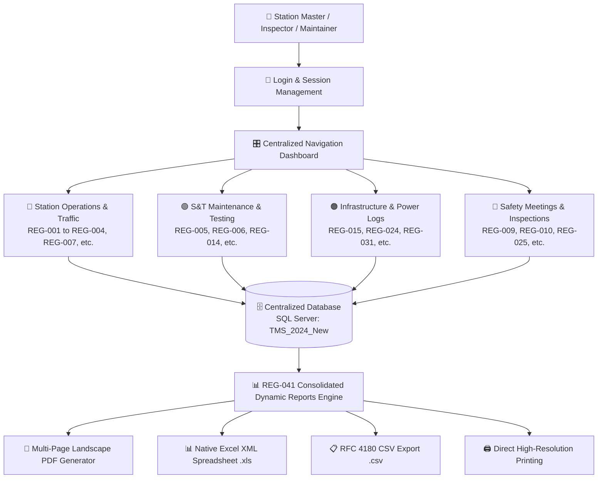

<div align="center">

# 🚆 INDIAN RAILWAYS — TRAIN MANAGEMENT SYSTEM (TMS)
### 🇮🇳 *Smart Digital Solution for Railway Station Registers & Centralized Operational Control*

<br/>

<!-- Animated Typing Dynamic Banner -->
<a href="#">
  
</a>

<br/>

<!-- Modern Status Badges -->
<p align="center">
  
  
  
  
  
</p>

<br/>

---

<!-- Highlighted Main Objective / Aim Card -->
<table width="100%" style="border-collapse: collapse; border: none;">
  <tr>
    <td align="left" style="background: linear-gradient(135deg, #0f172a 0%, #1e293b 50%, #0f172a 100%); padding: 25px 30px; border-radius: 12px; border-left: 6px solid #38bdf8; box-shadow: 0 10px 25px -5px rgba(0, 0, 0, 0.4);">
      <h3 style="color: #38bdf8; margin: 0 0 10px 0; font-size: 18px; font-family: 'Segoe UI', sans-serif;">
        🎯 AIM &amp; MAIN OBJECTIVE OF THE PROJECT
      </h3>
      <p style="color: #f1f5f9; font-size: 15.5px; line-height: 1.7; margin: 0; font-family: 'Segoe UI', sans-serif;">
        <b>The main objective of the Train Management System is to safely monitor, control, and manage train movements by replacing manual registers with a centralized digital system that stores train movement information, captures operational records, and generates reports for safety, operational control, and audits.</b>
      </p>
    </td>
  </tr>
</table>

---

</div>

<br/>

## 🌟 Why Train Management System (TMS)?

Traditional railway station operations depend on dozens of physical paper logbooks maintained manually by Station Masters, Traffic Inspectors, and S&T Maintainers. 

The **Train Management System (TMS)** completely modernizes station administration into a single, high-performance desktop application:

<table width="100%" style="border-collapse: collapse; border: none; margin-top: 15px;">
  <tr>
    <!-- Traditional Column -->
    <td width="48%" valign="top" style="background-color: #fff1f2; border: 1px solid #fecdd3; border-radius: 10px; padding: 20px;">
      <h3 style="color: #e11d48; margin-top: 0; margin-bottom: 12px; font-size: 16px;">
        🛑 TRADITIONAL PAPER SYSTEM
      </h3>
      <ul style="color: #881337; line-height: 1.8; margin: 0; padding-left: 20px; font-size: 14px;">
        <li>❌ <b>41 Bulky, physical paper books</b> per station.</li>
        <li>❌ <b>Risk of damaged, torn, or misplaced pages</b> over time.</li>
        <li>❌ <b>Time-consuming, manual shift handovers</b> and paper audits.</li>
        <li>❌ <b>Hours spent compiling inspection audit papers</b> manually.</li>
        <li>❌ <b>Flipping through hundreds of paper records</b> for past logs.</li>
      </ul>
    </td>
    
    <td width="4%" align="center" style="vertical-align: middle; border: none;">
      <span style="font-size: 24px; color: #64748b; font-weight: bold;">➔</span>
    </td>

    <!-- Modern TMS Column -->
    <td width="48%" valign="top" style="background-color: #f0fdf4; border: 1px solid #bbf7d0; border-radius: 10px; padding: 20px;">
      <h3 style="color: #16a34a; margin-top: 0; margin-bottom: 12px; font-size: 16px;">
        ⚡ CENTRALIZED DIGITAL TMS PLATFORM
      </h3>
      <ul style="color: #14532d; line-height: 1.8; margin: 0; padding-left: 20px; font-size: 14px;">
        <li>✅ <b>1 Centralized digital system</b> storing all station movements.</li>
        <li>✅ <b>Permanent, secure SQL Server database records</b> with zero data loss.</li>
        <li>✅ <b>Instant electronic handovers</b> with digital timestamps and Staff IDs.</li>
        <li>✅ <b>Instant 1-Click Multi-Page PDF &amp; Excel reports</b> for audits.</li>
        <li>✅ <b>Real-time multi-column search</b> across all 40 registers instantly.</li>
      </ul>
    </td>
  </tr>
</table>

<br/>

---

## 🏛️ System Architecture Workflow



<br/>

---

## 📋 The 41 Operational Registers by Department

<details open>
<summary><b>🔍 Click here to view all 41 Operational Railway Registers</b></summary>
<br/>

| Register Code | Register Name | Operational Scope &amp; Tracked Information |
| :---: | :--- | :--- |
| <span style="background-color:#0284c7;color:white;padding:3px 8px;border-radius:4px;font-weight:bold;">REG-001</span> | **Station Master's Diary** | Daily station operational log, category classification, event narrative, and reported by. |
| <span style="background-color:#0284c7;color:white;padding:3px 8px;border-radius:4px;font-weight:bold;">REG-002</span> | **Train Signal Register** | Train number, UP/DOWN direction, platform/line, arrival, departure, and passed times. |
| <span style="background-color:#0284c7;color:white;padding:3px 8px;border-radius:4px;font-weight:bold;">REG-003</span> | **SWR Acknowledgment** | Station Working Rules assurance, staff ID, rule version, reading date, and verifier name. |
| <span style="background-color:#0284c7;color:white;padding:3px 8px;border-radius:4px;font-weight:bold;">REG-004</span> | **Caution Order Register** | Speed limit restrictions (10–160 km/h), section, engineering reason, and validity period. |
| <span style="background-color:#16a34a;color:white;padding:3px 8px;border-radius:4px;font-weight:bold;">REG-005</span> | **Signal / Point / Block Failure** | Asset type, asset ID, failure timestamp, reported maintainer, and rectification time. |
| <span style="background-color:#16a34a;color:white;padding:3px 8px;border-radius:4px;font-weight:bold;">REG-006</span> | **S&amp;T Discon / Recon** | Disconnection permit, gear ID, maintainer ID, SM approval, and reconnection time. |
| <span style="background-color:#0284c7;color:white;padding:3px 8px;border-radius:4px;font-weight:bold;">REG-007</span> | **Bio-Metric Attendance** | Staff ID, shift assigned (Morning/Evening/Night), punch timestamps, and duty presence. |
| <span style="background-color:#0284c7;color:white;padding:3px 8px;border-radius:4px;font-weight:bold;">REG-008</span> | **Stabled Load Register** | Train/Rake ID, stabling siding/line, stabled time, and handbrake pinning safety checks. |
| <span style="background-color:#dc2626;color:white;padding:3px 8px;border-radius:4px;font-weight:bold;">REG-009</span> | **Fog Signalman Deployment** | Staff ID, post kilometer location, detonator count, and shift start/end times. |
| <span style="background-color:#dc2626;color:white;padding:3px 8px;border-radius:4px;font-weight:bold;">REG-010</span> | **Night Inspection Register** | Inspecting officer name, visit time, staff alertness, and night-working observations. |
| <span style="background-color:#0284c7;color:white;padding:3px 8px;border-radius:4px;font-weight:bold;">REG-011</span> | **Public Complaints** | Passenger name, PNR / ticket number, complaint category, and grievance details. |
| <span style="background-color:#0284c7;color:white;padding:3px 8px;border-radius:4px;font-weight:bold;">REG-012</span> | **Staff Grievances** | Staff employee ID, issue type, grievance subject, and resolution remarks. |
| <span style="background-color:#dc2626;color:white;padding:3px 8px;border-radius:4px;font-weight:bold;">REG-013</span> | **Inspection &amp; Observations** | Officer ID, inspection scope, deficiencies observed, and compliance due date. |
| <span style="background-color:#16a34a;color:white;padding:3px 8px;border-radius:4px;font-weight:bold;">REG-014</span> | **Miscellaneous Counter** | Emergency Route Release / Calling-on counters, old value, new value, and auth ref. |
| <span style="background-color:#ea580c;color:white;padding:3px 8px;border-radius:4px;font-weight:bold;">REG-015</span> | **Siding Key Register** | Siding key ID, issued staff, purpose, checkout/return timestamps, and safety checklist. |
| <span style="background-color:#16a34a;color:white;padding:3px 8px;border-radius:4px;font-weight:bold;">REG-016</span> | **Crank Handle Register** | Point number, crank handle ID, authorization PN, operator ID, and extraction log. |
| <span style="background-color:#16a34a;color:white;padding:3px 8px;border-radius:4px;font-weight:bold;">REG-017</span> | **Crank Handle Testing** | Handle ID, test date, test type, tester ID, and interlocking test outcome (Pass/Fail). |
| <span style="background-color:#16a34a;color:white;padding:3px 8px;border-radius:4px;font-weight:bold;">REG-018</span> | **Cross-Over Testing** | Crossover ID, locking verification, detection verification, and maintainer signature. |
| <span style="background-color:#16a34a;color:white;padding:3px 8px;border-radius:4px;font-weight:bold;">REG-019</span> | **Signal Failure Register** | Signal ID, failure timestamp, failure classification, root cause, and repair actions. |
| <span style="background-color:#16a34a;color:white;padding:3px 8px;border-radius:4px;font-weight:bold;">REG-020</span> | **Emergency Key Register** | Emergency key ID, asset ID, checkout/return timestamps, and controller authorization. |
| <span style="background-color:#0284c7;color:white;padding:3px 8px;border-radius:4px;font-weight:bold;">REG-021</span> | **Complete Arrival Register** | Train number, arrival time, wagon count (1–120), guard ID, and SM verification. |
| <span style="background-color:#0284c7;color:white;padding:3px 8px;border-radius:4px;font-weight:bold;">REG-022</span> | **Control Instructions** | Directives from Section Controller, message type, validity window, and staff acknowledgement. |
| <span style="background-color:#0284c7;color:white;padding:3px 8px;border-radius:4px;font-weight:bold;">REG-023</span> | **SM Relief Diary** | Relieving SM ID, Relieved SM ID, handover time, pending operational issues, and weather. |
| <span style="background-color:#ea580c;color:white;padding:3px 8px;border-radius:4px;font-weight:bold;">REG-024</span> | **Traffic / Power Block** | Block type (Line/Power/Joint), section, granted time, and cancellation time. |
| <span style="background-color:#dc2626;color:white;padding:3px 8px;border-radius:4px;font-weight:bold;">REG-025</span> | **Safety Meeting Register** | Meeting type, chairperson, attendees, agenda, Minutes of Meeting (MoM), and action items. |
| <span style="background-color:#dc2626;color:white;padding:3px 8px;border-radius:4px;font-weight:bold;">REG-026</span> | **HQ Safety Circulars** | Circular reference number, subject, effective date, and SM acknowledgment stamp. |
| <span style="background-color:#dc2626;color:white;padding:3px 8px;border-radius:4px;font-weight:bold;">REG-027</span> | **Safety Meeting Part 2** | Deliberations summary, safety directives, action item assignees, and deadlines. |
| <span style="background-color:#0284c7;color:white;padding:3px 8px;border-radius:4px;font-weight:bold;">REG-028</span> | **Staff Biodata &amp; Training** | Employee ID, PME medical exam dates, safety camp refresher dates, and competency expiry. |
| <span style="background-color:#0284c7;color:white;padding:3px 8px;border-radius:4px;font-weight:bold;">REG-029</span> | **Assurance Register** | Safety circular acknowledgment, document ID, rule version, and digital sign-off. |
| <span style="background-color:#0284c7;color:white;padding:3px 8px;border-radius:4px;font-weight:bold;">REG-030</span> | **Private Number (PN) Sheet** | PN exchange numbers, purpose, associated train number, and recipient station master. |
| <span style="background-color:#ea580c;color:white;padding:3px 8px;border-radius:4px;font-weight:bold;">REG-031</span> | **Petty Repairs** | Asset category, asset ID, defect description, assigned department, and completion status. |
| <span style="background-color:#0284c7;color:white;padding:3px 8px;border-radius:4px;font-weight:bold;">REG-032</span> | **Attendance Late Marks** | Shift timing compliance, late arrival remarks, and supervisor authorization. |
| <span style="background-color:#0284c7;color:white;padding:3px 8px;border-radius:4px;font-weight:bold;">REG-033</span> | **Passenger Complaint Log** | Detailed passenger grievance, 10-digit mobile number, PNR, department, and status. |
| <span style="background-color:#0284c7;color:white;padding:3px 8px;border-radius:4px;font-weight:bold;">REG-034</span> | **Employee Complaint Log** | Internal staff grievances, urgency level (Low/Medium/High/Critical), and resolution. |
| <span style="background-color:#ea580c;color:white;padding:3px 8px;border-radius:4px;font-weight:bold;">REG-035</span> | **Power Supply &amp; DG Log** | Primary source (EB/Solar), failure time, DG run hours, and diesel fuel level (liters). |
| <span style="background-color:#dc2626;color:white;padding:3px 8px;border-radius:4px;font-weight:bold;">REG-036</span> | **Officers Inspection** | Division officer inspection, station inspected, irregularities found, and priority level. |
| <span style="background-color:#dc2626;color:white;padding:3px 8px;border-radius:4px;font-weight:bold;">REG-037</span> | **Traffic Inspector (TI) Audit** | TI credentials, operational audit findings, rule violation citations, and instructions. |
| <span style="background-color:#16a34a;color:white;padding:3px 8px;border-radius:4px;font-weight:bold;">REG-038</span> | **Joint Inspection** | Joint departments (S&T + Engineering/P-Way), asset ID, measured value, and consensus. |
| <span style="background-color:#dc2626;color:white;padding:3px 8px;border-radius:4px;font-weight:bold;">REG-039</span> | **Night Inspection Part 2** | Signal visibility checks, safety equipment status, and corrective actions taken. |
| <span style="background-color:#16a34a;color:white;padding:3px 8px;border-radius:4px;font-weight:bold;">REG-040</span> | **Failure Rectification** | Failure link ID, root cause, repair actions performed, and post-repair test result. |
| <span style="background-color:#7c3aed;color:white;padding:3px 8px;border-radius:4px;font-weight:bold;">REG-041</span> | **Consolidated Dynamic Reports** | **Multi-table cross-register querying, 1–3 day filter engine, and PDF/Excel/CSV exports.** |

</details>

<br/>

---

## 📊 In-Depth: REG-041 Consolidated Dynamic Reports Engine

The **Dynamic Reports Module (REG-041)** is the flagship audit and analytical engine of TMS. It automatically aggregates operational records across all 40 individual register tables into a single unified workspace:

```
╔═════════════════════════════════════════════════════════════════════════════════════════════════════════════╗
║ 📅 PRESETS : [ Today (1 Day) ]   [ Yesterday & Today (2 Days) ]   [ Last 3 Days (Max 3-Day Limit) ]          ║
║ 🎯 SCOPE   : [ ALL REGISTERS (001 - 040 CONSOLIDATED) ▼ ]         [ 🔍 FETCH DATA ]                          ║
╠═════════════════════════════════════════════════════════════════════════════════════════════════════════════╣
║ 📈 STATS   : Total Records: 1,482  |  Active Tables: 38/40  |  Date Span: 18-Aug-2026 to 20-Aug-2026         ║
║ 🔍 SEARCH  : [ Filter across any column, train number, or keyword in real-time...                         ] ║
║ 📥 EXPORTS : [ 📥 PDF (Multi-Page) ]   [ 📊 Excel (.xls) ]   [ 📄 CSV (.csv) ]   [ 🖨️ Print ]                 ║
╠═════════════════════════════════════════════════════════════════════════════════════════════════════════════╣
║ S.No │ Reg Code │ Register Name │ Record ID │ Category │ Description │ Asset/Point │ Status │ Staff │ Time   ║
║  1   │ REG-001  │ Station Diary │ TMS-001-..│ Operation│ Track clear │ Platform 1  │ Done   │ 2323  │ 10:15  ║
║  2   │ REG-002  │ Train Signal  │ TMS-002-..│ Express  │ 12727 UP    │ Line 1      │ Depart │ 5412  │ 10:20  ║
║  3   │ REG-005  │ Signal Fail   │ TMS-005-..│ Signal   │ Pt 101 lock │ Signal S-4  │ Fixed  │ 9842  │ 10:35  ║
╚═════════════════════════════════════════════════════════════════════════════════════════════════════════════╝
```

### 💎 Key Capabilities of Dynamic Reports:

1. **⚡ Fast Cross-Register Querying**:
   - Queries across 40 separate SQL Server tables simultaneously in milliseconds using optimized indexed date filters.
2. **📅 Strict 1–3 Day Operational Windows**:
   - Provides instant 1-click presets (`Today`, `Yesterday & Today`, `Last 3 Days`) with an enforced 3-day query span for safety and performance compliance.
3. **🔄 Live Auto-Fetch**:
   - Data refreshes automatically whenever date boundaries or register dropdown filters change without needing manual clicks.
4. **📄 High-Definition Multi-Page PDF Exporter**:
   - Custom GDI+ landscape PDF printing engine featuring official Indian Railways navy headers, bordered table cells, and automatic page breaks with `Page X of Y` pagination.
5. **📊 Native Excel & CSV File Exports**:
   - Exports all 11 structured parameters directly into Excel XML spreadsheets (`.xls`) and standard CSV files (`.csv`) for higher management reviews.
6. **🖱️ 2-Finger Touchpad Horizontal Scrolling**:
   - Native gesture interception (`WM_MOUSEHWHEEL`) enabling smooth left-and-right two-finger touchpad scrolling across wide multi-column tables.
7. **🖥️ Clean UI & Taskbar Integration**:
   - Dynamically adapts to `Screen.WorkingArea`, preventing the Windows Taskbar from ever being hidden.

<br/>

---

## ⚡ Quick Start & Installation

### Step 1: Open the Solution
Open **`TMSfinal1.slnx`** or `TMSfinal1.sln` in **Visual Studio** (2019, 2022, or 2026).

### Step 2: Verify Database Connection
Ensure SQL Server is running and points to `TMS_2024_New` in [`App.config`](file:///c:/Users/Asus/Zeta_resp/TMSfinal1/TMSfinal1/TMSfinal1/App.config):
```xml
<connectionStrings>
  <add name="TMSConnection" 
       connectionString="Data Source=localhost\SQLEXPRESS;Initial Catalog=TMS_2024_New;Integrated Security=True;TrustServerCertificate=True" 
       providerName="System.Data.SqlClient" />
</connectionStrings>
```

### Step 3: Run the Application
Press <kbd>F5</kbd> (or click **▶ Start**). The system will compile and launch the main dashboard!

<br/>

---

## 📁 Clean Repository Structure

```plaintext
📦 Train_Station_Registers
 ┣ 📂 TMSfinal1
 ┃ ┣ 📄 Form_Reg001_StationDiary.cs ... Form_Reg040_FailureInspection.cs (All 40 Registers)
 ┃ ┣ 📄 Form_Reg041_DynamicReports.cs   (Consolidated Reports & Multi-Page PDF Engine)
 ┃ ┣ 📄 DatabaseHelper.cs               (SQL Server connection and queries)
 ┃ ┣ 📄 SessionManager.cs               (User session tracking and role security)
 ┃ ┣ 📄 ThemeManager.cs                 (Railway Navy UI Theme & Visual Styling)
 ┃ ┣ 📄 App.config                      (Database configuration)
 ┃ ┗ 📄 Program.cs                      (Application entry point)
 ┣ 📂 Database                          (SQL table scripts & schema migrations)
 ┣ 📄 .gitignore                        (Visual Studio & .NET ignore rules)
 ┣ 📄 README.md                         (System documentation)
 ┗ 📄 TMSfinal1.slnx                    (Visual Studio solution file)
```

<br/>

---

<div align="center">
  <p style="color: #64748b; font-size: 13.5px; font-family: 'Segoe UI', sans-serif;">
    <b>INDIAN RAILWAYS — TRAIN MANAGEMENT SYSTEM (TMS)</b><br/>
    <i>Engineered for Operational Safety, High Availability, and Digital Excellence.</i><br/>
    <sub>© 2026 All rights reserved.</sub>
  </p>
</div>
