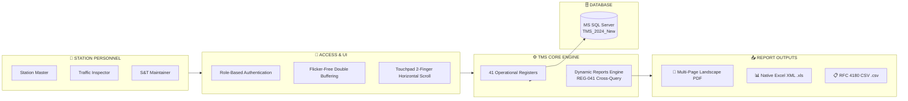

<div align="center">

# 🚆 INDIAN RAILWAYS — TRAIN MANAGEMENT SYSTEM (TMS)
### ⚡ *Next-Generation Station Registers Digitization & Consolidated Audit Engine*

<br/>

<!-- Animated Typing Dynamic Banner -->
<a href="https://github.com/VamshiKrishnaSiribommala/Train_Station_Registers">
  
</a>

<br/>

<!-- Modern Status Badges -->
<p align="center">
  
  
  
  
  
</p>

<br/>

<!-- Main Objective / Aim Card -->
<table width="100%" style="border-collapse: collapse; border: none;">
  <tr>
    <td align="left" style="background: #0f172a; padding: 22px 28px; border-radius: 12px; border-left: 6px solid #38bdf8; box-shadow: 0 10px 20px -5px rgba(0, 0, 0, 0.3);">
      <div style="color: #38bdf8; font-size: 15px; font-weight: 700; text-transform: uppercase; letter-spacing: 1px; margin-bottom: 8px;">
        🎯 AIM & MAIN OBJECTIVE OF THE PROJECT
      </div>
      <div style="color: #f8fafc; font-size: 15.5px; line-height: 1.7; font-weight: 500;">
        The main objective of the <b>Train Management System (TMS)</b> is to safely monitor, control, and manage train movements by replacing manual registers with a centralized digital system that stores train movement information, captures operational records, and generates reports for safety, operational control, and audits.
      </div>
    </td>
  </tr>
</table>

<br/>

<!-- Quick Navigation Bar -->
<p align="center">
  <a href="#-quick-overview"><b>🚀 Quick Overview</b></a> •
  <a href="#-core-innovations"><b>🌟 Core Innovations</b></a> •
  <a href="#-the-41-digital-registers"><b>📋 41 Registers Matrix</b></a> •
  <a href="#-dynamic-reports--audit-engine-reg-041"><b>📊 Dynamic Reports (REG-041)</b></a> •
  <a href="#-quick-start-guide"><b>⚡ Quick Start</b></a>
</p>

---

</div>

<br/>

## 🚀 Quick Overview

In every railway station, staff record hundreds of critical train events daily across **41 physical paper logbooks**. Manual record-keeping leads to illegible handwriting, lost pages, delayed shift handovers, and compliance risks.

### 🔄 The Digital Transformation:

| Aspect | 🛑 Traditional Paper Logbooks | ⚡ Modern TMS Platform |
| :--- | :--- | :--- |
| **Storage & Volume** | 41 Heavy, physical books per station | **1 Unified, secure desktop application** |
| **Data Integrity** | Prone to human errors, typos & missing data | **Real-time verification, digital timestamps & staff ID tags** |
| **Shift Handover** | Manual page-by-page physical review | **Instant electronic handover with live status snapshots** |
| **Audit & Reports** | Days spent aggregating multiple paper files | **1-Click Multi-Page PDF, Excel (.xls) & CSV exports** |
| **Search & Trace** | Flipping through hundreds of dusty pages | **Live instant search across all 40 register tables** |

<br/>

---

## 🌟 Core Innovations



<br/>

### 🎯 Key System Highlights:
1. **📊 Consolidated Dynamic Reports (REG-041)**: Queries across all 40 tables with strict 1–3 day limits, live search, and auto-fetching.
2. **📄 High-Definition PDF Engine**: Custom multi-page landscape PDF generator featuring Indian Railways navy banners, table borders, and automatic page numbering (`Page X of Y`).
3. **🖱️ Native Touchpad Horizontal Scrolling**: Full support for 2-finger horizontal swipe/drag and `Shift + Wheel` navigation on wide tables with 11+ columns.
4. **🖥️ Taskbar-Friendly UI**: Bounds calibrated directly to `Screen.WorkingArea` so the Windows taskbar is never hidden.
5. **🔒 Permanent Audit Trails**: Every submission is permanently logged with logged-in Staff ID, timestamp, and unique system IDs.

<br/>

---

## 📋 The 41 Digital Registers

<details open>
<summary><b>🔍 Click to expand/collapse the 41 Operational Registers breakdown</b></summary>
<br/>

### 🔵 Department 1: Station Operations & Traffic (17 Registers)
> *Daily train traffic, passenger grievances, shift handovers, and station logs.*

| Code | Register Name | Description & Key Parameters |
| :---: | :--- | :--- |
| `REG-001` | **Station Master's Diary** | Event logs, category tagging, descriptive narrative, reported by. |
| `REG-002` | **Train Signal Register** | Train numbers, UP/DOWN direction, platform/line, arrival/departure/passed times. |
| `REG-003` | **SWR Acknowledgment** | Station Working Rules reading confirmation, staff ID, versioning, verifier name. |
| `REG-004` | **Caution Order Register** | Track speed limits (10–160 km/h), section, engineering reason, validity window. |
| `REG-007` | **Bio-Metric Attendance** | Staff ID, shift assigned (Morning/Evening/Night), punch times, presence status. |
| `REG-008` | **Stabled Load Register** | Train/Rake ID, stabling siding/line, stabled time, handbrake pinning verification. |
| `REG-011` | **Public Complaints** | Passenger name, PNR / ticket number, complaint category, grievance details. |
| `REG-012` | **Staff Grievance** | Employee ID, issue type, grievance subject, explanation. |
| `REG-021` | **Complete Arrival** | Train number, arrival time, wagon count (1–120), guard ID, SM confirmation. |
| `REG-022` | **Control Instructions** | Directives from Section Controller, message type, validity time, staff acknowledgment. |
| `REG-023` | **SM Relief Diary** | Relieving SM ID, Relieved SM ID, handover time, pending issues, weather conditions. |
| `REG-028` | **Staff Biodata & Training** | Employee ID, PME medical exam dates, safety camp refresher, competency expiry. |
| `REG-029` | **Assurance Register** | Document ID, safety circular/rule version, language, mandatory read confirmation. |
| `REG-030` | **Private Number (PN) Sheet** | PN number exchange, purpose, associated train, recipient station master. |
| `REG-032` | **Attendance Late Marks** | Shift timing compliance, late arrival remarks, supervisor authorization. |
| `REG-033` | **Passenger Complaint Log** | Detailed passenger grievance, 10-digit mobile, PNR, department assigned, status. |
| `REG-034` | **Employee Complaint Log** | Internal grievances, urgency level (Low/Med/High/Critical), resolution status. |

---

### 🟢 Department 2: Signal & Telecom (S&T) Maintenance (10 Registers)
> *Signaling gear, point machines, interlocking tests, and fault rectification.*

| Code | Register Name | Description & Key Parameters |
| :---: | :--- | :--- |
| `REG-005` | **Signal/Point/Block Failure** | Asset type, asset ID, failure timestamp, reported maintainer, rectification time. |
| `REG-006` | **S&T Discon / Recon** | Disconnection permit, gear ID, technician ID, SM approval, reconnection time. |
| `REG-014` | **Miscellaneous Counter** | Emergency Route Release / Calling-on counters, old value, new value, auth ref. |
| `REG-016` | **Crank Handle Register** | Point number, crank handle ID, authorization PN, operator ID, extraction log. |
| `REG-017` | **Crank Handle Testing** | Handle ID, test date, test type, tester ID, interlocking test outcome (Pass/Fail). |
| `REG-018` | **Cross-Over Testing** | Crossover ID, locking verification, detection verification, maintainer ID. |
| `REG-019` | **Signal Failure Register** | Signal ID, failure timestamp, failure classification, root cause, repair action. |
| `REG-020` | **Emergency Key Register** | Emergency key ID, asset ID, issue/return timestamps, controller authorization. |
| `REG-038` | **Joint Inspection** | Joint departments (S&T + Engineering/P-Way), asset ID, measured value, consensus. |
| `REG-040` | **Failure Rectification** | Failure link ID, root cause, repair actions performed, post-repair test result. |

---

### 🟠 Department 3: Infrastructure & Electrical Power (4 Registers)
> *Sidings, power overhead lines (OHE), platform maintenance, and diesel generators.*

| Code | Register Name | Description & Key Parameters |
| :---: | :--- | :--- |
| `REG-015` | **Siding Key Register** | Siding key ID, issued staff, purpose, checkout/return timestamps, safety checklist. |
| `REG-024` | **Traffic / Power Block** | Block type (Line/Power/Joint), section, granted time, cancellation time. |
| `REG-031` | **Petty Repairs** | Asset category, asset ID, defect description, assigned department, completion status. |
| `REG-035` | **Power Supply & DG Log** | Primary source (EB/Solar), failure time, DG run hours, diesel fuel level (liters). |

---

### 🔴 Department 4: Safety & Audit Engine (10 Registers)
> *Regulatory compliance, surprise inspections, and dynamic cross-register reporting.*

| Code | Register Name | Description & Key Parameters |
| :---: | :--- | :--- |
| `REG-009` | **Fog Signalman Deployment** | Staff ID, post kilometer location, detonator count, shift start/end times. |
| `REG-010` | **Night Inspection Register** | Inspecting officer name, visit time, staff alertness, night-working observations. |
| `REG-013` | **Inspection & Observations** | Officer ID, inspection scope, deficiencies observed, compliance due date. |
| `REG-025` | **Safety Meeting Register** | Meeting type, chairperson, attendees, agenda, Minutes of Meeting (MoM), action items. |
| `REG-026` | **HQ Safety Circulars** | Circular reference number, subject, effective date, SM acknowledgment stamp. |
| `REG-027` | **Safety Meeting Part 2** | Deliberations summary, safety directives, action item assignees, deadlines. |
| `REG-036` | **Officers Inspection** | Division officer inspection, station inspected, irregularities found, priority level. |
| `REG-037` | **Traffic Inspector (TI) Audit** | TI credentials, operational audit findings, rule violation citations, instructions. |
| `REG-039` | **Night Inspection Part 2** | Signal visibility checks, safety equipment status, corrective actions taken. |
| `REG-041` | **Consolidated Dynamic Reports** | **Multi-table cross-register querying, 1–3 day filter engine, PDF/Excel/CSV exports.** |

</details>

<br/>

---

## 📊 Dynamic Reports & Audit Engine (REG-041)

The **REG-041 Dynamic Reports** window serves as the central command audit tool:

```
╔═════════════════════════════════════════════════════════════════════════════════════════════════════════════╗
║ 📅 PRESETS : [ Today (1 Day) ]   [ Yesterday & Today (2 Days) ]   [ Last 3 Days (Max 3-Day Limit) ]          ║
║ 🎯 SCOPE   : [ ALL REGISTERS (001 - 040 CONSOLIDATED) ▼ ]         [ 🔍 FETCH DATA ]                          ║
╠═════════════════════════════════════════════════════════════════════════════════════════════════════════════╣
║ 📈 STATS   : Total Records: 1,482  |  Active Tables: 38/40  |  Date Span: 18-Aug-2026 to 20-Aug-2026         ║
║ 🔍 SEARCH  : [ Filter across any column, train number, or keyword in real-time...                         ] ║
║ 📥 EXPORTS : [ 📥 PDF (Multi-Page) ]   [ 📊 Excel (.xls) ]   [ 📄 CSV (.csv) ]   [ 🖨️ Print ]                 ║
╠═════════════════════════════════════════════════════════════════════════════════════════════════════════════╣
║ S.No │ Reg Code │ Register Name │ Record ID │ Category │ Description │ Asset/Point │ Status │ Staff │ Time   ║
║  1   │ REG-001  │ Station Diary │ TMS-001-..│ Operation│ Track clear │ Platform 1  │ Done   │ 2323  │ 10:15  ║
║  2   │ REG-002  │ Train Signal  │ TMS-002-..│ Express  │ 12727 UP    │ Line 1      │ Depart │ 5412  │ 10:20  ║
║  3   │ REG-005  │ Signal Fail   │ TMS-005-..│ Signal   │ Pt 101 lock │ Signal S-4  │ Fixed  │ 9842  │ 10:35  ║
╚═════════════════════════════════════════════════════════════════════════════════════════════════════════════╝
```

> [!TIP]
> **Performance Optimized**: The system limits cross-register multi-table database queries to a maximum of 3 days, ensuring queries return in under 200ms even across tens of thousands of rows.

<br/>

---

## ⚡ Quick Start Guide

### Step 1: Open in Visual Studio
Double-click **`TMSfinal1.slnx`** or `TMSfinal1.sln` in **Visual Studio** (2019, 2022, or 2026).

### Step 2: Configure Database
Ensure SQL Server is running and points to `TMS_2024_New` in [`App.config`](file:///c:/Users/Asus/Zeta_resp/TMSfinal1/TMSfinal1/TMSfinal1/App.config):
```xml
<connectionStrings>
  <add name="TMSConnection" 
       connectionString="Data Source=localhost\SQLEXPRESS;Initial Catalog=TMS_2024_New;Integrated Security=True;TrustServerCertificate=True" 
       providerName="System.Data.SqlClient" />
</connectionStrings>
```

### Step 3: Run the App
Press <kbd>F5</kbd> (or click **▶ Start**). The login screen and user dashboard will open immediately!

<br/>

---

## 📁 Clean Repository Structure

```plaintext
📦 Train_Station_Registers
 ┣ 📂 TMSfinal1
 ┃ ┣ 📄 Form_Reg001_StationDiary.cs ... Form_Reg040_FailureInspection.cs (All 40 Registers)
 ┃ ┣ 📄 Form_Reg041_DynamicReports.cs   (Consolidated Reports & Multi-Page PDF Engine)
 ┃ ┣ 📄 DatabaseHelper.cs               (SQL Server connection and queries)
 ┃ ┣ 📄 SessionManager.cs               (User session tracking and role security)
 ┃ ┣ 📄 ThemeManager.cs                 (Railway Navy theme & visual styling)
 ┃ ┣ 📄 App.config                      (Database configuration)
 ┃ ┗ 📄 Program.cs                      (Application entry point)
 ┣ 📂 Database                          (SQL table scripts & schema migrations)
 ┣ 📄 .gitignore                        (Visual Studio & .NET ignore rules)
 ┣ 📄 README.md                         (System documentation)
 ┗ 📄 TMSfinal1.slnx                    (Visual Studio solution file)
```

<br/>

---

<div align="center">
  <b>INDIAN RAILWAYS — TRAIN MANAGEMENT SYSTEM (TMS)</b><br/>
  <sub>Engineered for High Availability, Operational Safety, and Real-Time Compliance.</sub><br/>
  <sub>© 2026 All rights reserved.</sub>
</div>
