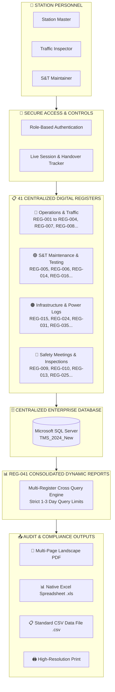

<div align="center">

# 🚆 INDIAN RAILWAYS — TRAIN MANAGEMENT SYSTEM (TMS)
### 🇮🇳 *Smart Digital Solution for Railway Station Registers & Centralized Operational Control*

<br/>

<!-- Animated Dynamic Typing Banner -->
<a href="#">
  
</a>

<br/>

<!-- Modern Status Badges -->
<p align="center">
  
  
  
  
  
</p>

<br/>

<!-- Main Objective Card with Visual Border & Shadow -->
<table width="100%" style="border-collapse: collapse; border: none;">
  <tr>
    <td align="left" style="background: #0f172a; padding: 22px 28px; border-radius: 12px; border-left: 6px solid #38bdf8; box-shadow: 0 10px 20px -5px rgba(0, 0, 0, 0.3);">
      <div style="color: #38bdf8; font-size: 15px; font-weight: 700; text-transform: uppercase; letter-spacing: 1px; margin-bottom: 8px;">
        🎯 AIM & MAIN OBJECTIVE OF THE PROJECT
      </div>
      <div style="color: #f8fafc; font-size: 15.5px; line-height: 1.7; font-weight: 500;">
        The main objective of the <b>Train Management System (TMS)</b> is to safely monitor, control, and manage train movements by replacing manual registers with a centralized digital system that stores train movement information, captures operational records, and generates reports for safety, operational control, and audits.
      </div>
    </td>
  </tr>
</table>

</div>

<br/>

---

## 🌟 The Digital Evolution

<table width="100%" style="border-collapse: collapse; border: none; margin-top: 10px;">
  <tr>
    <!-- Traditional Column -->
    <td width="48%" valign="top" style="background: #fff1f2; border: 1px solid #fecdd3; border-radius: 10px; padding: 20px;">
      <h3 style="color: #e11d48; margin-top: 0; display: flex; align-items: center;">
        🛑 Traditional Paper System
      </h3>
      <ul style="color: #881337; line-height: 1.8; margin-bottom: 0; padding-left: 20px;">
        <li><b>41 Bulky paper registers</b> cluttering the Station Master's desk.</li>
        <li><b>Manual handwriting</b> prone to errors, ink spills, and torn pages.</li>
        <li><b>Slow shift handovers</b> requiring manual verification of page entries.</li>
        <li><b>Tedious audits</b> taking hours or days to gather physical books.</li>
        <li><b>High risk</b> of misplaced logs and untraceable changes.</li>
      </ul>
    </td>
    
    <td width="4%" align="center" style="vertical-align: middle; border: none;">
      <span style="font-size: 24px; color: #64748b;">➔</span>
    </td>

    <!-- Modern TMS Column -->
    <td width="48%" valign="top" style="background: #f0fdf4; border: 1px solid #bbf7d0; border-radius: 10px; padding: 20px;">
      <h3 style="color: #16a34a; margin-top: 0; display: flex; align-items: center;">
        ⚡ Centralized Digital TMS
      </h3>
      <ul style="color: #14532d; line-height: 1.8; margin-bottom: 0; padding-left: 20px;">
        <li><b>1 Unified desktop application</b> managing all station activities.</li>
        <li><b>Instant auto-fill</b>, digital timestamps, and tamper-proof records.</li>
        <li><b>Seamless shift handover</b> with live station status snapshots.</li>
        <li><b>1-Click Dynamic Reports</b> exported directly to PDF, Excel, or CSV.</li>
        <li><b>Permanent SQL Server storage</b> with instant search across all tables.</li>
      </ul>
    </td>
  </tr>
</table>

<br/>

---

## 🏛️ System Architecture & Operational Workflow



<br/>

---

## 📋 The 41 Operational Registers by Department

<details open>
<summary><b>🔍 Click here to view all 41 Operational Railway Registers</b></summary>
<br/>

<table width="100%" style="border-collapse: collapse; border: 1px solid #e2e8f0; border-radius: 8px;">
  <!-- Operations Section -->
  <tr style="background: #0284c7; color: white;">
    <th colspan="3" style="padding: 12px 16px; text-align: left; font-size: 15px;">
      🔵 1. STATION OPERATIONS &amp; TRAIN TRAFFIC (17 Registers)
    </th>
  </tr>
  <tr style="background: #f8fafc; font-weight: bold; border-bottom: 1px solid #e2e8f0;">
    <td width="15%" style="padding: 8px 12px;">Register Code</td>
    <td width="35%" style="padding: 8px 12px;">Register Name</td>
    <td width="50%" style="padding: 8px 12px;">Operational Scope &amp; Tracked Information</td>
  </tr>
  <tr><td style="padding: 8px 12px;"><code>REG-001</code></td><td style="font-weight: 600; padding: 8px 12px;">Station Master's Diary</td><td style="padding: 8px 12px;">Daily station log, operational event narrative, category classification.</td></tr>
  <tr><td style="padding: 8px 12px;"><code>REG-002</code></td><td style="font-weight: 600; padding: 8px 12px;">Train Signal Register</td><td style="padding: 8px 12px;">Train number, UP/DOWN direction, platform/line, arrival &amp; departure times.</td></tr>
  <tr><td style="padding: 8px 12px;"><code>REG-003</code></td><td style="font-weight: 600; padding: 8px 12px;">SWR Acknowledgment</td><td style="padding: 8px 12px;">Station Working Rules reading assurance, staff ID, rule versioning.</td></tr>
  <tr><td style="padding: 8px 12px;"><code>REG-004</code></td><td style="font-weight: 600; padding: 8px 12px;">Caution Order Register</td><td style="padding: 8px 12px;">Speed limit restrictions (10–160 km/h), section, reason, validity window.</td></tr>
  <tr><td style="padding: 8px 12px;"><code>REG-007</code></td><td style="font-weight: 600; padding: 8px 12px;">Bio-Metric Attendance</td><td style="padding: 8px 12px;">Staff ID, shift assigned (Morning/Evening/Night), punch timestamps.</td></tr>
  <tr><td style="padding: 8px 12px;"><code>REG-008</code></td><td style="font-weight: 600; padding: 8px 12px;">Stabled Load Register</td><td style="padding: 8px 12px;">Parked rake ID, stabling line, stabled time, handbrake pinning status.</td></tr>
  <tr><td style="padding: 8px 12px;"><code>REG-011</code></td><td style="font-weight: 600; padding: 8px 12px;">Public Complaints</td><td style="padding: 8px 12px;">Passenger name, PNR / ticket number, grievance details, complaint category.</td></tr>
  <tr><td style="padding: 8px 12px;"><code>REG-012</code></td><td style="font-weight: 600; padding: 8px 12px;">Staff Grievances</td><td style="padding: 8px 12px;">Employee staff ID, issue type, grievance subject, resolution notes.</td></tr>
  <tr><td style="padding: 8px 12px;"><code>REG-021</code></td><td style="font-weight: 600; padding: 8px 12px;">Complete Arrival Register</td><td style="padding: 8px 12px;">Train number, arrival time, wagon count (1–120), guard ID, tail-lamp verification.</td></tr>
  <tr><td style="padding: 8px 12px;"><code>REG-022</code></td><td style="font-weight: 600; padding: 8px 12px;">Control Instructions</td><td style="padding: 8px 12px;">Directives from Section Controller, message type, validity period, acknowledgment.</td></tr>
  <tr><td style="padding: 8px 12px;"><code>REG-023</code></td><td style="font-weight: 600; padding: 8px 12px;">SM Relief Diary</td><td style="padding: 8px 12px;">Relieving SM ID, Relieved SM ID, handover time, pending operational issues.</td></tr>
  <tr><td style="padding: 8px 12px;"><code>REG-028</code></td><td style="font-weight: 600; padding: 8px 12px;">Staff Biodata &amp; Training</td><td style="padding: 8px 12px;">Employee ID, PME medical exam dates, safety camp refresher, competency expiry.</td></tr>
  <tr><td style="padding: 8px 12px;"><code>REG-029</code></td><td style="font-weight: 600; padding: 8px 12px;">Assurance Register</td><td style="padding: 8px 12px;">Safety circular acknowledgment, document ID, rule version, staff confirmation.</td></tr>
  <tr><td style="padding: 8px 12px;"><code>REG-030</code></td><td style="font-weight: 600; padding: 8px 12px;">Private Number (PN) Sheet</td><td style="padding: 8px 12px;">PN exchange numbers, purpose, associated train number, recipient station.</td></tr>
  <tr><td style="padding: 8px 12px;"><code>REG-032</code></td><td style="font-weight: 600; padding: 8px 12px;">Attendance Late Marks</td><td style="padding: 8px 12px;">Shift punctuality, late arrival remarks, supervisor authorization.</td></tr>
  <tr><td style="padding: 8px 12px;"><code>REG-033</code></td><td style="font-weight: 600; padding: 8px 12px;">Passenger Complaint Log</td><td style="padding: 8px 12px;">Passenger grievance details, 10-digit mobile number, PNR, assigned department.</td></tr>
  <tr><td style="padding: 8px 12px;"><code>REG-034</code></td><td style="font-weight: 600; padding: 8px 12px;">Employee Complaint Log</td><td style="padding: 8px 12px;">Internal staff grievances, urgency level (Low/Med/High/Critical), status.</td></tr>

  <!-- Maintenance Section -->
  <tr style="background: #16a34a; color: white;">
    <th colspan="3" style="padding: 12px 16px; text-align: left; font-size: 15px;">
      🟢 2. SIGNAL &amp; TELECOM (S&amp;T) MAINTENANCE (10 Registers)
    </th>
  </tr>
  <tr><td style="padding: 8px 12px;"><code>REG-005</code></td><td style="font-weight: 600; padding: 8px 12px;">Signal / Point / Block Failure</td><td style="padding: 8px 12px;">Asset type, asset ID, failure timestamp, maintainer ID, rectification time.</td></tr>
  <tr><td style="padding: 8px 12px;"><code>REG-006</code></td><td style="font-weight: 600; padding: 8px 12px;">S&amp;T Discon / Recon</td><td style="padding: 8px 12px;">Disconnection permit, gear ID, maintainer ID, SM approval, reconnection time.</td></tr>
  <tr><td style="padding: 8px 12px;"><code>REG-014</code></td><td style="font-weight: 600; padding: 8px 12px;">Miscellaneous Counter</td><td style="padding: 8px 12px;">Emergency Route Release / Calling-on counters, old value, new value, auth ref.</td></tr>
  <tr><td style="padding: 8px 12px;"><code>REG-016</code></td><td style="font-weight: 600; padding: 8px 12px;">Crank Handle Register</td><td style="padding: 8px 12px;">Point number, crank handle ID, authorization PN, operator ID, extraction log.</td></tr>
  <tr><td style="padding: 8px 12px;"><code>REG-017</code></td><td style="font-weight: 600; padding: 8px 12px;">Crank Handle Testing</td><td style="padding: 8px 12px;">Handle ID, test date, test type, tester ID, interlocking test outcome (Pass/Fail).</td></tr>
  <tr><td style="padding: 8px 12px;"><code>REG-018</code></td><td style="font-weight: 600; padding: 8px 12px;">Cross-Over Testing</td><td style="padding: 8px 12px;">Crossover ID, locking verification, detection verification, maintainer signature.</td></tr>
  <tr><td style="padding: 8px 12px;"><code>REG-019</code></td><td style="font-weight: 600; padding: 8px 12px;">Signal Failure Register</td><td style="padding: 8px 12px;">Signal ID, failure timestamp, failure classification, root cause, repair actions.</td></tr>
  <tr><td style="padding: 8px 12px;"><code>REG-020</code></td><td style="font-weight: 600; padding: 8px 12px;">Emergency Key Register</td><td style="padding: 8px 12px;">Emergency key ID, asset ID, checkout/return timestamps, controller authorization.</td></tr>
  <tr><td style="padding: 8px 12px;"><code>REG-038</code></td><td style="font-weight: 600; padding: 8px 12px;">Joint Inspection</td><td style="padding: 8px 12px;">Joint departments (S&amp;T + Engineering/P-Way), asset ID, measured values.</td></tr>
  <tr><td style="padding: 8px 12px;"><code>REG-040</code></td><td style="font-weight: 600; padding: 8px 12px;">Failure Rectification</td><td style="padding: 8px 12px;">Failure link ID, root cause, repair actions performed, post-repair test result.</td></tr>

  <!-- Infrastructure Section -->
  <tr style="background: #ea580c; color: white;">
    <th colspan="3" style="padding: 12px 16px; text-align: left; font-size: 15px;">
      🟠 3. INFRASTRUCTURE &amp; ELECTRICAL POWER (4 Registers)
    </th>
  </tr>
  <tr><td style="padding: 8px 12px;"><code>REG-015</code></td><td style="font-weight: 600; padding: 8px 12px;">Siding Key Register</td><td style="padding: 8px 12px;">Siding key ID, issued staff, purpose, checkout/return timestamps, safety checklist.</td></tr>
  <tr><td style="padding: 8px 12px;"><code>REG-024</code></td><td style="font-weight: 600; padding: 8px 12px;">Traffic / Power Block</td><td style="padding: 8px 12px;">Block type (Line/Power/Joint), section, granted time, cancellation time.</td></tr>
  <tr><td style="padding: 8px 12px;"><code>REG-031</code></td><td style="font-weight: 600; padding: 8px 12px;">Petty Repairs</td><td style="padding: 8px 12px;">Asset category, asset ID, defect description, assigned department, status.</td></tr>
  <tr><td style="padding: 8px 12px;"><code>REG-035</code></td><td style="font-weight: 600; padding: 8px 12px;">Power Supply &amp; DG Log</td><td style="padding: 8px 12px;">Primary source (EB/Solar), failure time, DG run hours, diesel fuel level (liters).</td></tr>

  <!-- Safety Section -->
  <tr style="background: #dc2626; color: white;">
    <th colspan="3" style="padding: 12px 16px; text-align: left; font-size: 15px;">
      🔴 4. SAFETY, AUDIT &amp; DYNAMIC REPORTING (10 Registers)
    </th>
  </tr>
  <tr><td style="padding: 8px 12px;"><code>REG-009</code></td><td style="font-weight: 600; padding: 8px 12px;">Fog Signalman Deployment</td><td style="padding: 8px 12px;">Staff ID, post kilometer location, detonator count, shift start/end times.</td></tr>
  <tr><td style="padding: 8px 12px;"><code>REG-010</code></td><td style="font-weight: 600; padding: 8px 12px;">Night Inspection Register</td><td style="padding: 8px 12px;">Inspecting officer name, visit time, staff alertness, night observations.</td></tr>
  <tr><td style="padding: 8px 12px;"><code>REG-013</code></td><td style="font-weight: 600; padding: 8px 12px;">Inspection &amp; Observations</td><td style="padding: 8px 12px;">Officer ID, inspection scope, deficiencies observed, compliance due date.</td></tr>
  <tr><td style="padding: 8px 12px;"><code>REG-025</code></td><td style="font-weight: 600; padding: 8px 12px;">Safety Meeting Register</td><td style="padding: 8px 12px;">Meeting type, chairperson, attendees, agenda, Minutes of Meeting (MoM).</td></tr>
  <tr><td style="padding: 8px 12px;"><code>REG-026</code></td><td style="font-weight: 600; padding: 8px 12px;">HQ Safety Circulars</td><td style="padding: 8px 12px;">Circular reference number, subject, effective date, SM acknowledgment stamp.</td></tr>
  <tr><td style="padding: 8px 12px;"><code>REG-027</code></td><td style="font-weight: 600; padding: 8px 12px;">Safety Meeting Part 2</td><td style="padding: 8px 12px;">Deliberations summary, safety directives, action item assignees, deadlines.</td></tr>
  <tr><td style="padding: 8px 12px;"><code>REG-036</code></td><td style="font-weight: 600; padding: 8px 12px;">Officers Inspection</td><td style="padding: 8px 12px;">Division officer inspection, station inspected, irregularities found, priority.</td></tr>
  <tr><td style="padding: 8px 12px;"><code>REG-037</code></td><td style="font-weight: 600; padding: 8px 12px;">Traffic Inspector (TI) Audit</td><td style="padding: 8px 12px;">TI credentials, operational audit findings, rule violation citations.</td></tr>
  <tr><td style="padding: 8px 12px;"><code>REG-039</code></td><td style="font-weight: 600; padding: 8px 12px;">Night Inspection Part 2</td><td style="padding: 8px 12px;">Signal visibility checks, safety equipment status, corrective actions taken.</td></tr>
  <tr><td style="padding: 8px 12px;"><code>REG-041</code></td><td style="font-weight: 600; padding: 8px 12px;">Consolidated Dynamic Reports</td><td style="padding: 8px 12px;"><b>Multi-register cross-querying, 1–3 day filter engine, PDF/Excel/CSV exports.</b></td></tr>
</table>

</details>

<br/>

---

## 📊 REG-041 Consolidated Dynamic Reports Engine

The **Dynamic Reports Module (REG-041)** is the flagship audit and inspection engine of the Train Management System. It unites records from all 40 separate registers into a single, high-speed reporting workspace:

<br/>

<!-- Grid of 6 Beautiful Capability Cards -->
<table width="100%" style="border-collapse: collapse; border: none;">
  <tr>
    <td width="33%" style="padding: 12px; vertical-align: top;">
      <div style="background: #ffffff; border: 1px solid #e2e8f0; border-radius: 10px; padding: 18px; box-shadow: 0 4px 6px -1px rgba(0,0,0,0.05); height: 100%;">
        <div style="font-size: 20px; margin-bottom: 8px;">⚡ <b>Cross-Register Audit</b></div>
        <p style="color: #475569; font-size: 13.5px; line-height: 1.6; margin: 0;">
          Simultaneously queries across 40 separate database tables in milliseconds using indexed date filters.
        </p>
      </div>
    </td>
    <td width="33%" style="padding: 12px; vertical-align: top;">
      <div style="background: #ffffff; border: 1px solid #e2e8f0; border-radius: 10px; padding: 18px; box-shadow: 0 4px 6px -1px rgba(0,0,0,0.05); height: 100%;">
        <div style="font-size: 20px; margin-bottom: 8px;">📅 <b>1–3 Day Presets</b></div>
        <p style="color: #475569; font-size: 13.5px; line-height: 1.6; margin: 0;">
          Instant 1-click presets (<code>Today</code>, <code>Yesterday & Today</code>, <code>Last 3 Days</code>) capped at a strict 3-day window.
        </p>
      </div>
    </td>
    <td width="33%" style="padding: 12px; vertical-align: top;">
      <div style="background: #ffffff; border: 1px solid #e2e8f0; border-radius: 10px; padding: 18px; box-shadow: 0 4px 6px -1px rgba(0,0,0,0.05); height: 100%;">
        <div style="font-size: 20px; margin-bottom: 8px;">🔄 <b>Live Auto-Fetch</b></div>
        <p style="color: #475569; font-size: 13.5px; line-height: 1.6; margin: 0;">
          Instantly reloads data whenever date pickers or register scope dropdowns are changed without extra clicks.
        </p>
      </div>
    </td>
  </tr>
  <tr>
    <td width="33%" style="padding: 12px; vertical-align: top;">
      <div style="background: #ffffff; border: 1px solid #e2e8f0; border-radius: 10px; padding: 18px; box-shadow: 0 4px 6px -1px rgba(0,0,0,0.05); height: 100%;">
        <div style="font-size: 20px; margin-bottom: 8px;">📄 <b>Multi-Page Landscape PDF</b></div>
        <p style="color: #475569; font-size: 13.5px; line-height: 1.6; margin: 0;">
          Generates landscape PDFs complete with official Indian Railways navy banners, table borders, and <code>Page X of Y</code>.
        </p>
      </div>
    </td>
    <td width="33%" style="padding: 12px; vertical-align: top;">
      <div style="background: #ffffff; border: 1px solid #e2e8f0; border-radius: 10px; padding: 18px; box-shadow: 0 4px 6px -1px rgba(0,0,0,0.05); height: 100%;">
        <div style="font-size: 20px; margin-bottom: 8px;">📊 <b>Excel &amp; CSV Exports</b></div>
        <p style="color: #475569; font-size: 13.5px; line-height: 1.6; margin: 0;">
          Exports full 11 structured parameters directly into Excel XML spreadsheets (<code>.xls</code>) and RFC 4180 CSV files.
        </p>
      </div>
    </td>
    <td width="33%" style="padding: 12px; vertical-align: top;">
      <div style="background: #ffffff; border: 1px solid #e2e8f0; border-radius: 10px; padding: 18px; box-shadow: 0 4px 6px -1px rgba(0,0,0,0.05); height: 100%;">
        <div style="font-size: 20px; margin-bottom: 8px;">🖱️ <b>Touchpad Horizontal Scroll</b></div>
        <p style="color: #475569; font-size: 13.5px; line-height: 1.6; margin: 0;">
          Smooth two-finger left/right touchpad drag gestures and <code>Shift + MouseWheel</code> support across 11 columns.
        </p>
      </div>
    </td>
  </tr>
</table>

<br/>

---

## ⚡ Quick Start & Installation

<table width="100%" style="border-collapse: collapse; border: none;">
  <tr>
    <td width="33%" style="padding: 12px; vertical-align: top;">
      <div style="background: #f8fafc; border: 1px solid #e2e8f0; border-radius: 10px; padding: 20px; text-align: center;">
        <div style="font-size: 28px; margin-bottom: 10px;">1️⃣</div>
        <h4 style="margin: 0 0 8px 0; color: #0f172a;">Open Solution</h4>
        <p style="color: #64748b; font-size: 13px; margin: 0;">
          Open <code>TMSfinal1.slnx</code> or <code>TMSfinal1.sln</code> in Visual Studio 2019/2022/2026.
        </p>
      </div>
    </td>
    <td width="33%" style="padding: 12px; vertical-align: top;">
      <div style="background: #f8fafc; border: 1px solid #e2e8f0; border-radius: 10px; padding: 20px; text-align: center;">
        <div style="font-size: 28px; margin-bottom: 10px;">2️⃣</div>
        <h4 style="margin: 0 0 8px 0; color: #0f172a;">Check Database</h4>
        <p style="color: #64748b; font-size: 13px; margin: 0;">
          Ensure SQL Server connects to <code>TMS_2024_New</code> configured in <code>App.config</code>.
        </p>
      </div>
    </td>
    <td width="33%" style="padding: 12px; vertical-align: top;">
      <div style="background: #f8fafc; border: 1px solid #e2e8f0; border-radius: 10px; padding: 20px; text-align: center;">
        <div style="font-size: 28px; margin-bottom: 10px;">3️⃣</div>
        <h4 style="margin: 0 0 8px 0; color: #0f172a;">Press Run</h4>
        <p style="color: #64748b; font-size: 13px; margin: 0;">
          Press <kbd>F5</kbd> (or click <b>▶ Start</b>). The desktop app will launch immediately!
        </p>
      </div>
    </td>
  </tr>
</table>

<br/>

---

## 📁 Clean Repository Structure

```plaintext
📦 Train_Station_Registers
 ┣ 📂 TMSfinal1
 ┃ ┣ 📄 Form_Reg001_StationDiary.cs ... Form_Reg040_FailureInspection.cs (All 40 Registers)
 ┃ ┣ 📄 Form_Reg041_DynamicReports.cs   (Consolidated Reports & Multi-Page PDF Engine)
 ┃ ┣ 📄 DatabaseHelper.cs               (SQL Server ADO.NET connection & query engine)
 ┃ ┣ 📄 SessionManager.cs               (User session tracking and role security)
 ┃ ┣ 📄 ThemeManager.cs                 (Railway Navy UI Theme & visual styling)
 ┃ ┣ 📄 App.config                      (Database connection strings)
 ┃ ┗ 📄 Program.cs                      (Application entry point)
 ┣ 📂 Database                          (SQL table scripts & schema migrations)
 ┣ 📄 .gitignore                        (Visual Studio & .NET ignore rules)
 ┣ 📄 README.md                         (System documentation)
 ┗ 📄 TMSfinal1.slnx                    (Visual Studio solution file)
```

<br/>

---

<div align="center">
  <p style="color: #64748b; font-size: 13.5px; font-family: 'Segoe UI', sans-serif;">
    <b>INDIAN RAILWAYS — TRAIN MANAGEMENT SYSTEM (TMS)</b><br/>
    <i>Engineered for Operational Safety, High Availability, and Digital Excellence.</i><br/>
    <sub>© 2026 All rights reserved.</sub>
  </p>
</div>
